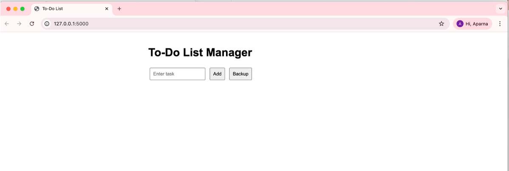
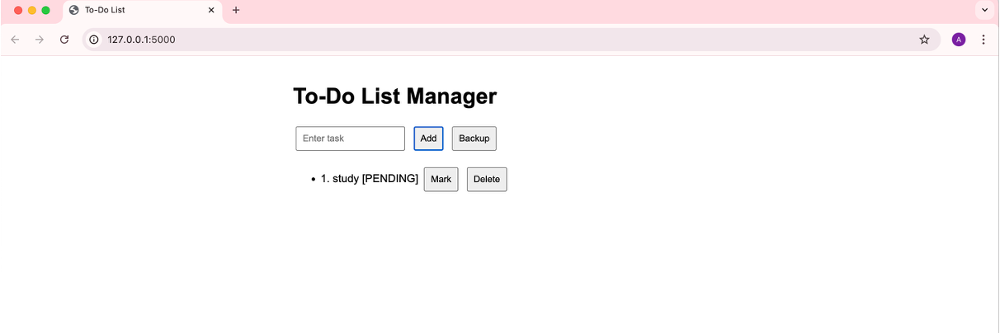
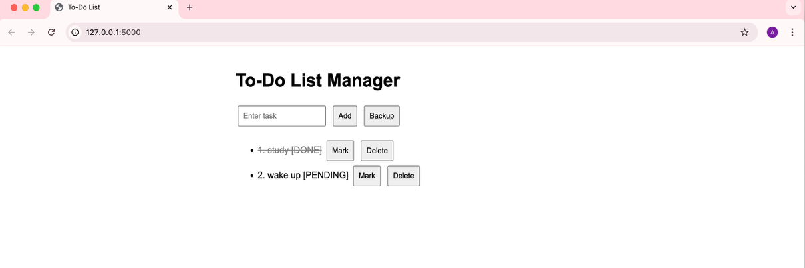
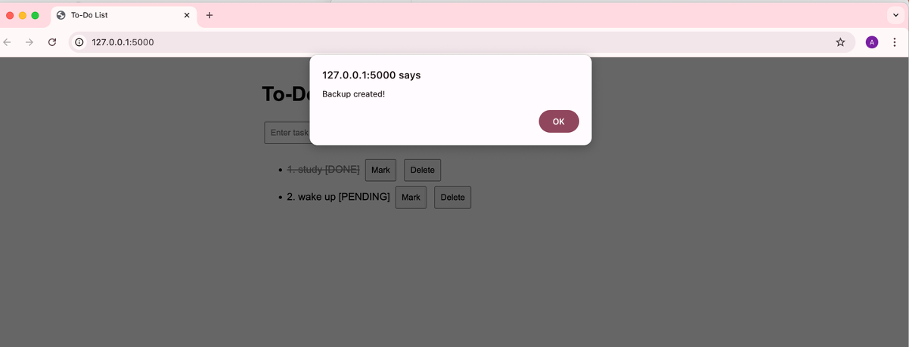

# 📝 To-Do List Manager using POSIX System Calls

     

A task management system that combines **C system calls**, a **Flask backend**, and an **interactive web frontend**. This project demonstrates how low-level OS file operations can integrate with modern web technologies to build real-time applications.

---

## 🚀 Features
- Add, view, mark as done, and delete tasks
- Persistent storage using `tasks.txt`
- Real-time updates via Flask + JavaScript
- User-friendly web interface

---

## 💻 Tech Stack
- **C** – System calls: `open`, `read`, `write`, `lseek`, `ftruncate`  
- **Python Flask** – Backend server  
- **HTML / CSS / JavaScript** – Frontend interface  
- **POSIX-compliant OS** – Tested on Linux/macOS

---

## 📸 Screenshots






---

## ⚡ How to Run

### 1️⃣ Backend
Open terminal, go to the backend folder, install dependencies, and run the Flask server:

```bash
cd backend
pip install -r requirements.txt
python3 app.py
```

### 2️⃣ Frontend
Open the frontend folder and launch the HTML page in your browser:

```bash
cd frontend
open index.html
```
The frontend will communicate with the Flask backend.

You can now add, view, mark as done, or delete tasks from the browser.

## 👥 Team Members
Aparna A

Jenishaa Bharathi M

Police Aryan

Pooja N

